# **一、绿源相机安卓版应用软件**

## **1.1项目简介**

本软件系统需要实现的模块有：相机模块，绿幕抠图模块，美颜模块和直播推流模块。所实现的应用软件功能模块结构如图1-1所示。现已完成各个单独的功能模块开发，目前正在把各个功能模块整合到一起，直到完成绿源相机安卓应用软件的完整开发。

APK下载地址：https://github.com/Tanlang180/Chroma-APK/tree/main/Chromav2.0.1

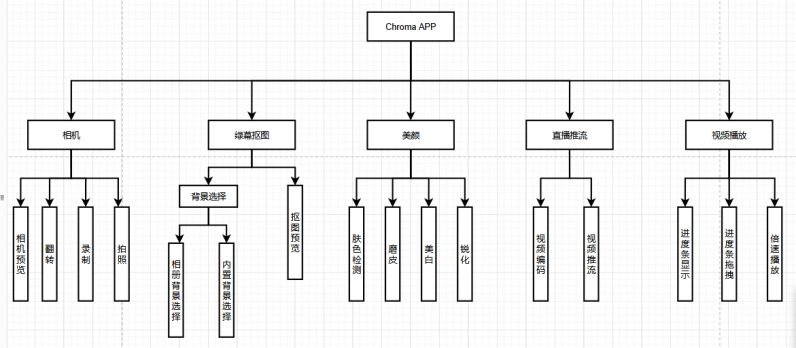 

图 1-1 绿源相机总体功能模块结构

## **1.2 软件界面展示**

绿源相机部分界面展示：

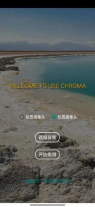 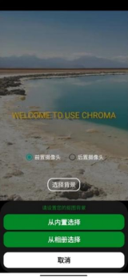 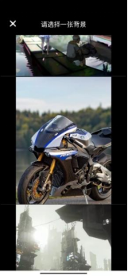 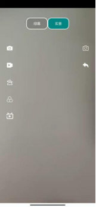

## **1.3绿源相机绿幕抠图功能**

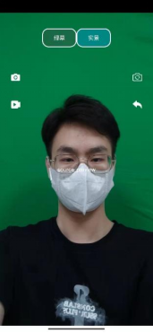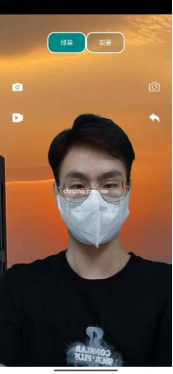 

## **1.4推流功能展示：**

本地推流展示：

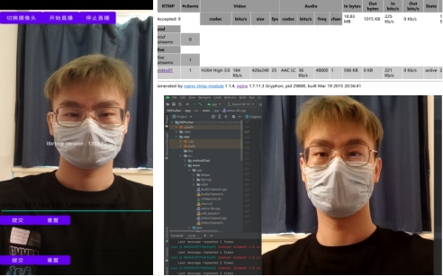 

推流到斗鱼直播间展示：

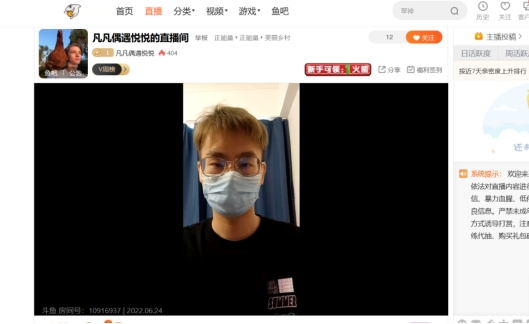 

 

 

## **1.5播放器功能展示**

基于FFmpeg编译库开发的音视频播放器功能，功能包含音视频开始/暂停播放、进度显示和拖动、倍速播放。开发时，以生产者-消费者模式引入多线程，完成音视频解码和播放；以音频时间戳为基准完成音视频同步播放；通过ANativeWindows显示播放视频。

功能界面展示：

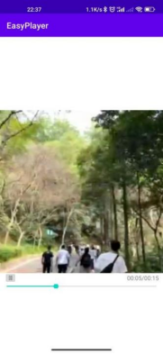 

 

## **1.6 美颜功能**

美颜包含基础的磨皮、美白、锐化。

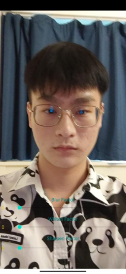      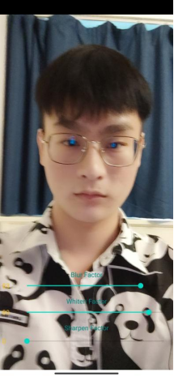

 

# 二、**基于深度学习的人像抠图系统**

基于NCNN框架部署深度抠图模型RobustVideoMatting，以开发人像抠图Android应用软件系统。使用Pytorch复现RVM论文模型，处理AdobeImageMatting等数据集，生成Batch数据输入网络，复现MobileNetV3-large BackBone，ConvGRU，Loss计算等，网络精度与原论文一致。训练模型并把模型转为NCNN模型文件，再结合OpenCV部署于安卓平台。系统功能还在完善，暂不提供APK下载。

功能展示：

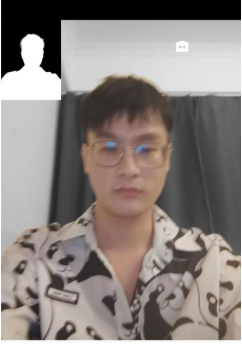 

对照相机捕获的视频图像做处理，屏幕左上角为RVM模型计算的人像遮罩；屏幕主要区域处，人像区域显示RGB图像，人像以外其他部分显示灰度图像。平均抠图速度为12FPS，速度待优化。